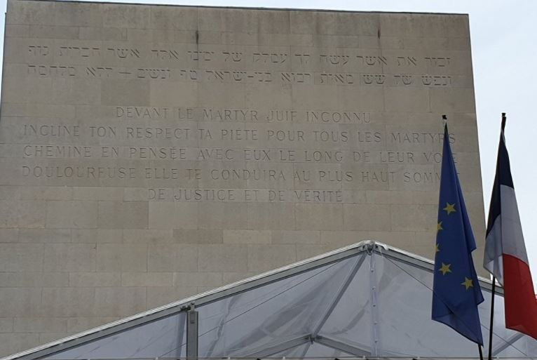
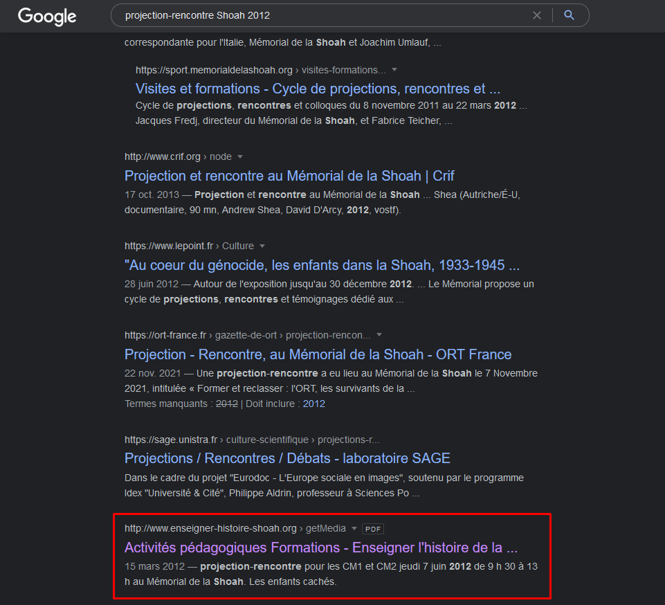
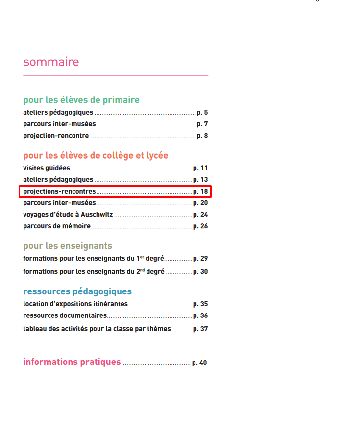
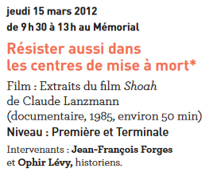

# **Devoir de mémoire**
## <u>**Catégorie**</u>

Commémoration

## <u>**Description**</u> :

```"Ceux qui ne connaissent pas leur histoire s'exposent à ce qu'elle recommence."``` disait Elie Wiesel, rescapé d'auschwitz.

Transmettre l’histoire aux nouvelles générations est une mission essentielle. Le mémorial de la Shoah de Paris propose aux élèves de primaire, collège et lycée des projections, ateliers, visites, parcours de mémoire, …

Ces activités pédagogiques et mémorielles suivent l’évolution des élèves, du primaire au lycée et aborde notamment l’histoire de la Shoah dans le respect des âges et des sensibilités du public.



***Question : Combien de temps durait la projection-rencontre : “Résister dans les centres de mise à mort”, proposée en 2011 / 2012 aux élèves de la 3ème à la terminale? (durée en minutes)***

bleuetdefrance{###}

## <u>**Auteur**</u> :

Club OSINT & Veille - AEGE

## <u>**Solution**</u> :

Pour ce chall, il suffit de chercher les projection-rencontre sur le thème de la Shoah en 2012.

Dans les premiers résultats, on remarque un PDF venant d'un site qui, d'après son titre, enseigne l'histoire de la Shoah. Ce PDF semble concerner des activités pédagogiques pour les années 2011-2012, ce qui nous indique que nous sommes sur la bonne voie.



En consultant le document, on tombe sur le sommaire qui nous redirige vers la page 18. 



En cherchant dans les différentes projections-rencontres, on tombe sur une qui semble correspondre :



Cet événement durant de 9h30 à 13h (soit 3h30), il suffit de convertir en minutes et on obtient notre flag.

**Flag : bleuetdefrance{210}**