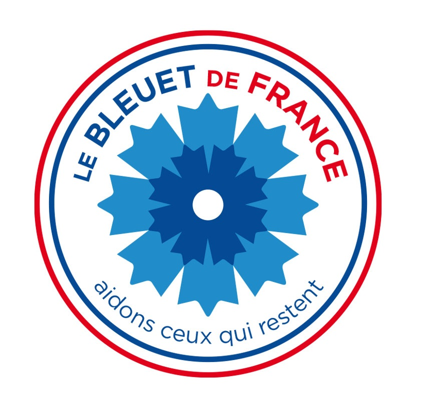
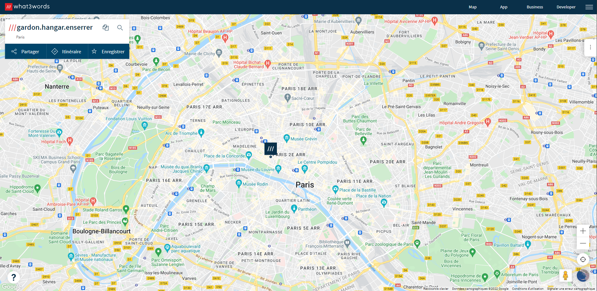
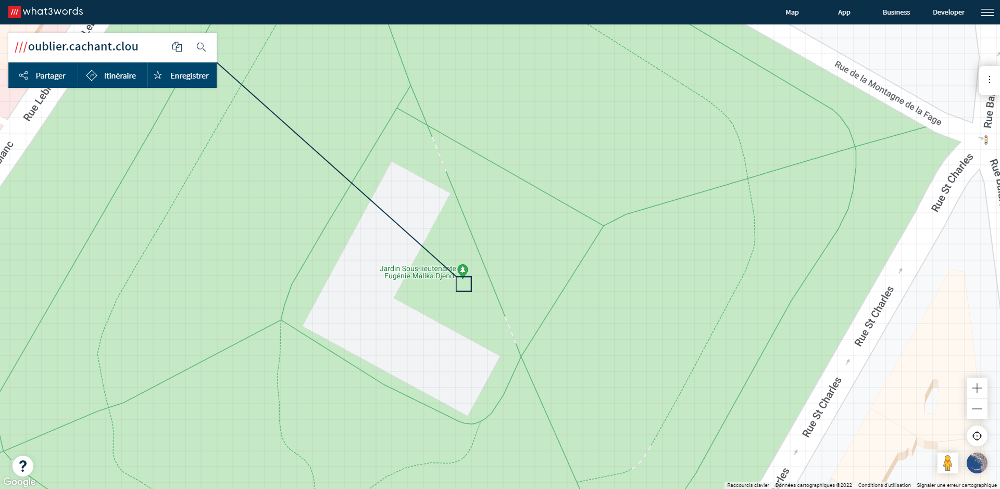

# **Mémoire et solidarité**
## <u>**Catégorie**</u>

Commémoration

## <u>**Description**</u> :

***Question : Aujourd’hui, que pouvons nous trouver en ce lieu sous le code : ///oublier.cachant.clou ?***

bleuetdefrance{réponsetoutattaché}

## <u>**Auteur**</u> :

Club OSINT & Veille - AEGE

## <u>**Solution**</u> :

Le code "///oublier.cachant.clou" nous fait immédiatement penser au site "what3words".  
Application assez unique, la communication d'un emplacement se fait à l'aide de trois mots du dictionnaire.

Il suffit désormais de rentrer le code dans la barre de recherche et un emplacement se dévoile :

C'est le Jardin Sous-lieutenante Eugénie-Malika Djendi.

Néanmoins, et après des essais infructueux, le flag ne fonctionne pas.

On décide donc de poursuivre nos recherches à cet endroit précis en utilisant Google Maps, afin de savoir si ce jardin ne cache pas un autre endroit.

On découvre que le Monument aux morts pour la France en opérations extérieures (OPEX) est au même endroit.

On obtient par la même occasion notre flag.

**Flag : bleuetdefrance{MonumentauxmortspourlaFranceenopérationsextérieures}**