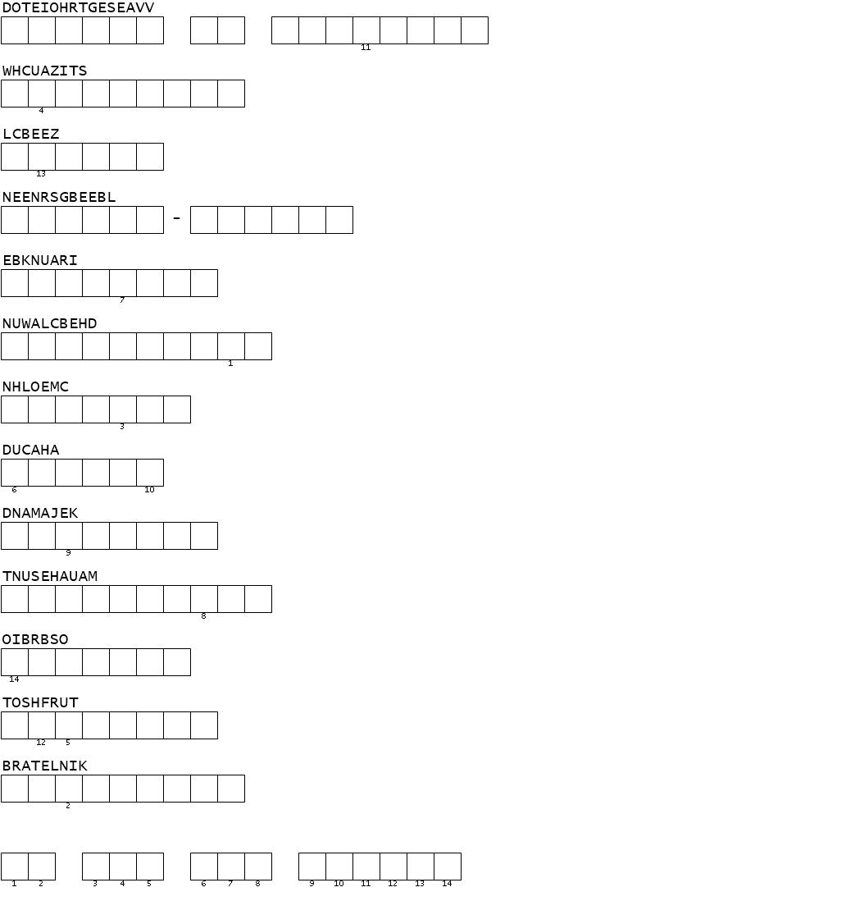
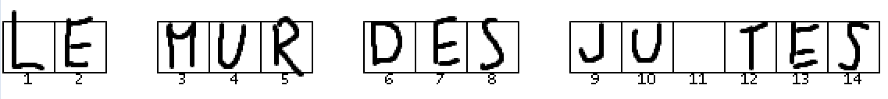

# **Puzzle Mémoriel**
## <u>**Catégorie**</u>

Commémoration

## <u>**Description**</u> :

***Question : Déchiffrez le puzzle pour découvrir la phrase.***

bleuetdefrance{réponsetoutattaché}

## <u>**Auteur**</u> :

Club OSINT & Veille - AEGE

## <u>**Solution**</u> :

Ici, une image nous est donnée :

On peut y voir des mots désordonnés à reconstituer ainsi qu'une phrase à former à partir de certaines lettres, ce qui sera notre flag.

Pour se mettre sur la bonne piste, on peut utiliser dcode et son Générateur d'Anagrammes.

En essayant plusieurs mots, une des réponses tombe :

DUCAHA correspond à... DACHAU !

On comprend donc qu'on cherche des noms de camps de concentration.

À partir du wikipédia (https://fr.wikipedia.org/wiki/Liste_des_camps_de_concentration_nazis), on va pouvoir reconstituer les noms manquants :

- DOTEIOHRTGESEAVV = 
- WHCUAZITS = AUSCHWITZ 
- LCBEEZ = BELZEC
- NEENRSGBEEBL = BERGEN-BELSEN
- EBKNUARI = BIRKENAU
- NUWALCBEHD = BUCHENWALD
- NHLOEMC = CHELMNO
- DUCAHA = DACHAU
- DNAMAJEK = MAJDANEK
- TNUSEHAUAM = MAUTHAUSEN
- OIBRBSO = SOBIBOR
- TOSHFRUT = STRUTHOF
- BRATELNIK = TREBLINKA

Impossible malheureusement de trouver le premier... Mais on va pouvoir faire sans en devinant la lettre manquante.

On peut désormais reconstituer le flag en piochant les différentes lettres dans les mots trouvés précédemment :

- AUSCHWITZ : U
- BELZEC : E
- BIRKENAU : E
- BUCHENWALD : L
- CHELMNO : M
- DACHAU : D, U
- MAJDANEK : J
- MAUTHAUSEN : S
- SOBIBOR : S
- STRUTHOF : T, R
- TREBLINKA : E

Ce qui nous donne :

"LE MUR DES JUSTES"

**Flag : bleuetdefrance{LEMURDESJUSTES}**