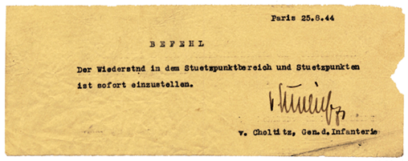
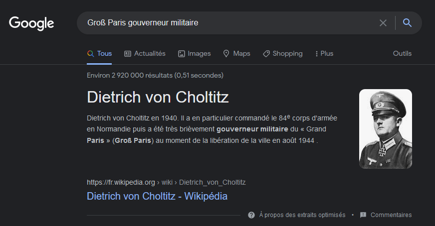
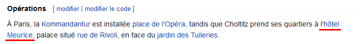
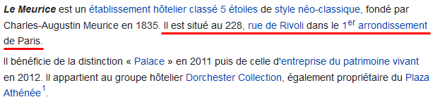
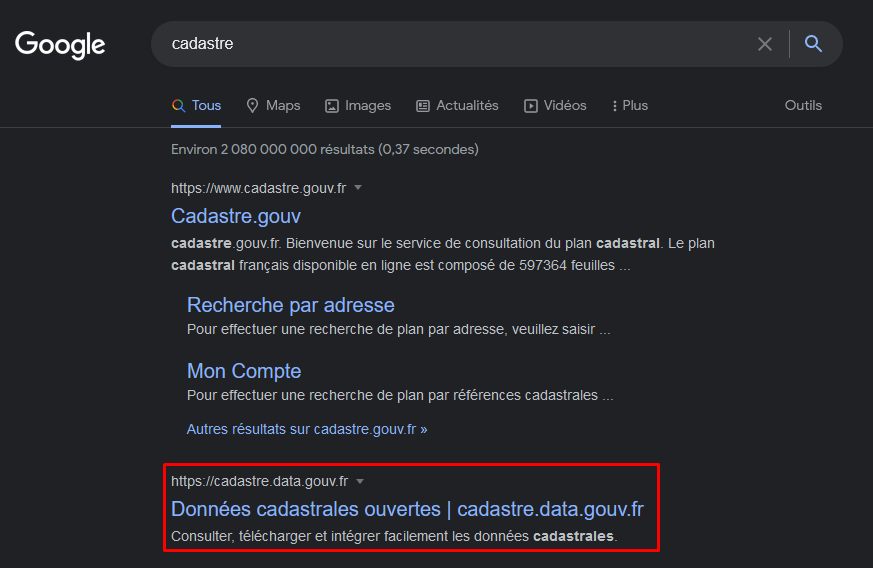
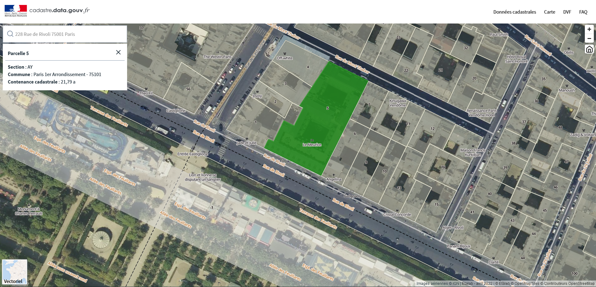

# **Baroud d'honneur**
## <u>**Catégorie**</u>

Libération

## <u>**Description**</u> :

Après un combat perdu d’avance, celui qui avait promis aux parisiens les pires sévices s'ils osaient lutter pour leur liberté fut capturé à son hôtel et la reddition allemande est signée le 25 août 1944.

***Question : Quel est la section et la parcelle cadastrale de l’hôtel où séjourna durant l’occupation le gouverneur militaire de la garnison du "Groß Paris" ? (réponse tout attaché : section et parcelle, 3 caractères sont attendus)***

bleuetdefrance{###}

## <u>**Auteur**</u> :

Club OSINT & Veille - AEGE

## <u>**Solution**</u> :

On commence par se renseigner sur le Groß Paris, et plus particulièrement sur son gouverneur militaire.

On apprend ici qu'il s'agit de "Dietrich von Choltitz".

En fouillant son wikipédia, on peut connaître l'hôtel dans lequel il séjournait.

Il s'agit de l'Hôtel "Le Meurice", un établissement hôtelier parisien de grand standing. 

On récupère également l'adresse du lieu via sa page wikipédia.

Une fois l'adresse récupérée, on va s'intéresser aux données cadastrales de l'établissement.

En recherchant simplement "cadastre" sur Google, on tombe sur des résultats intéressants :

Il semble exister une base de données cadastrales ouvertes. Initiative qui semble avoir été créée par ETALAB et la DINUM.

En recherchant donc sur cette base de données l'adresse de notre hôtel, on tombe le résultat attendu.

La section est donc "AY" et la Parcelle 5. On a notre flag.

**Flag : bleuetdefrance{AY5}**