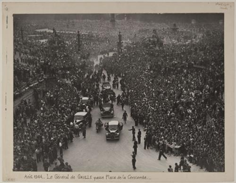
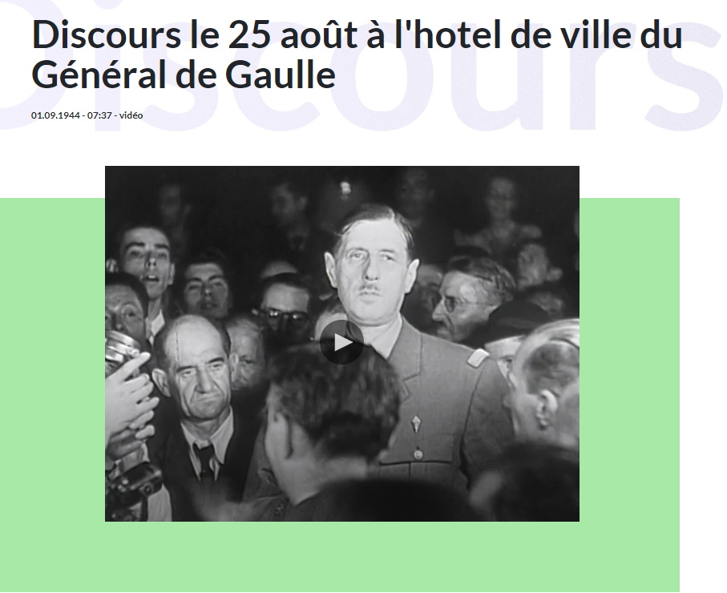
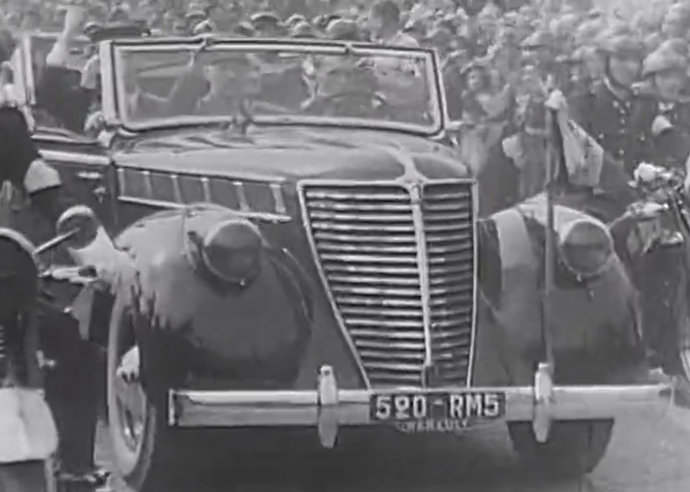
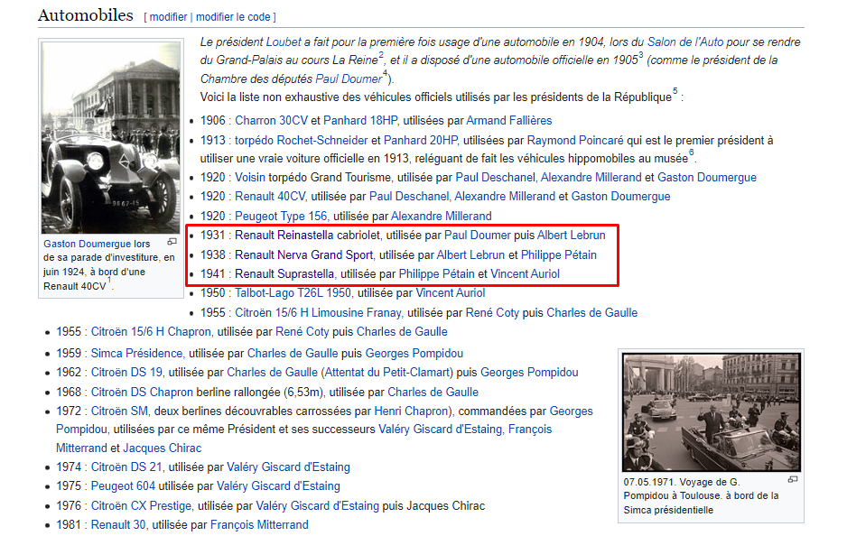
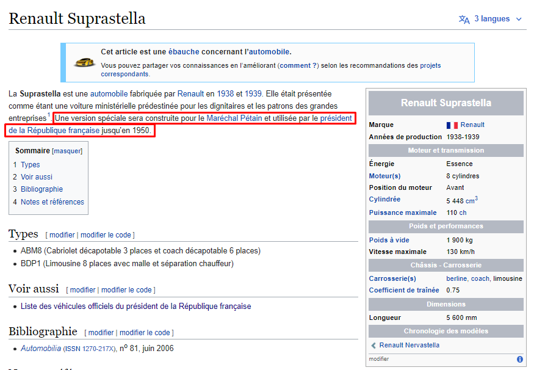
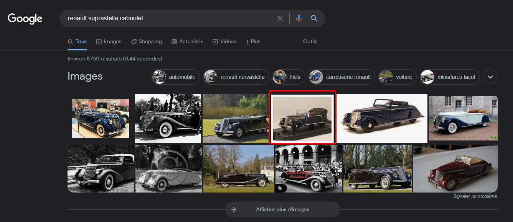
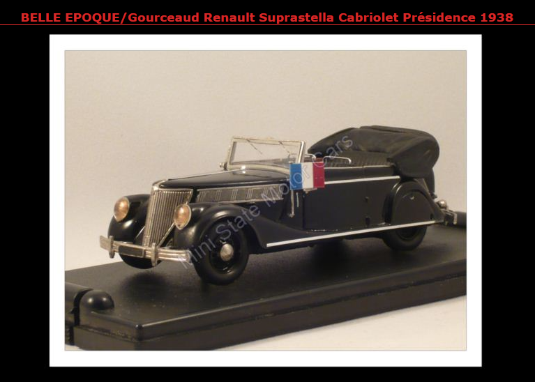

# **Entrée dans Paris**
## <u>**Catégorie**</u>

Libération

## <u>**Description**</u> :

Le 25 août 1944, le Général De Gaulle entre dans une ville libérée de l’occupation allemande. Paris triomphe grâce à la résistance que le général a lui-même représenté. Chacun de ses déplacements a alors une valeur hautement symbolique, et politique.

***Question : Quel est le modèle complet du véhicule présidentiel utilisé par le général de Gaulle lors de ses déplacements ce jour-là ? (Un lien est également disponible : https://www.ina.fr/ina-eclaire-actu/video/i00007088/discours-le-25-aout-a-l-hotel-de-ville-du-general-de-gaulle)***

bleuetdefrance{référencecomplètetoutattaché}

## <u>**Auteur**</u> :

Club OSINT & Veille - AEGE

## <u>**Solution**</u> :

On commence par consulter le lien dans la question.

Ce lien nous redirige vers une vidéo de l'INA sur le discours du 25 août 1944 à l'hôtel de ville du Général de Gaulle.  
On note donc la date, le 25 août 1944

En regardant la vidéo, on remarque le modèle de la voiture (inscrit sur la plaque) : Renault

On va donc s'intéresser aux véhicules utilisés par la présidence française durant l'année 1944.  
Ca tombe bien, une page wikipédia existe pour ça : https://fr.wikipedia.org/wiki/Liste_des_v%C3%A9hicules_officiels_du_pr%C3%A9sident_de_la_R%C3%A9publique_fran%C3%A7aise

Ici, 3 modèles semblent correspondre : 

- La première, une Renault Reinastella carbiolet
- La seconde, une Renault Nerva Grand Sport
- La troisième et dernière, une Renault Suprastella 

En comparant le modèle des véhicules avec celui de la vidéo, seule la Suprastella semble correspondre.

On apprend d'ailleurs sur sa page wikipédia que le modèle Suprastella aura servi jusqu'en 1950

Nous recherchons néanmoins une version cabriolet et nous apprenons sur cette même page qu'un tel modèle existe, sous le nom ABM8.

Le flag bleuetdefrance{RenaultSuprastellaABM8} ne fonctionnant pas, on doit alors enquêter plus profondémment sur le modèle de cette voiture.

En cherchant plus profondémment sur google avec les termes "renault suprastella cabriolet", un résultat attire l'oeil : 

Le drapeau français intriguant directement, on consulte cette page

Sur cette page, la Suprastella est désignée en tant que Cabriolet Présidence 1938.

On peut alors essayer 3 flags différents pour commencer :

- bleuetdefrance{RenaultSuprastellaCabriolet}  
- bleuetdefrance{RenaultSuprastellaCabrioletPrésidence}  
- bleuetdefrance{RenaultSuprastellaCabrioletPrésidence1938}  

Heureusement, le premier flag est le bon !

**Flag : bleuetdefrance{RenaultSuprastellaCabriolet}**