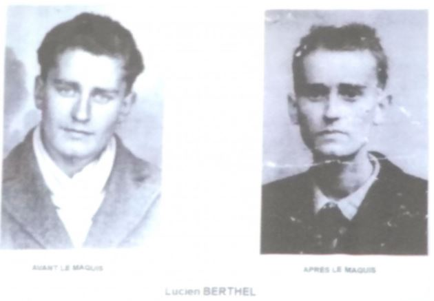
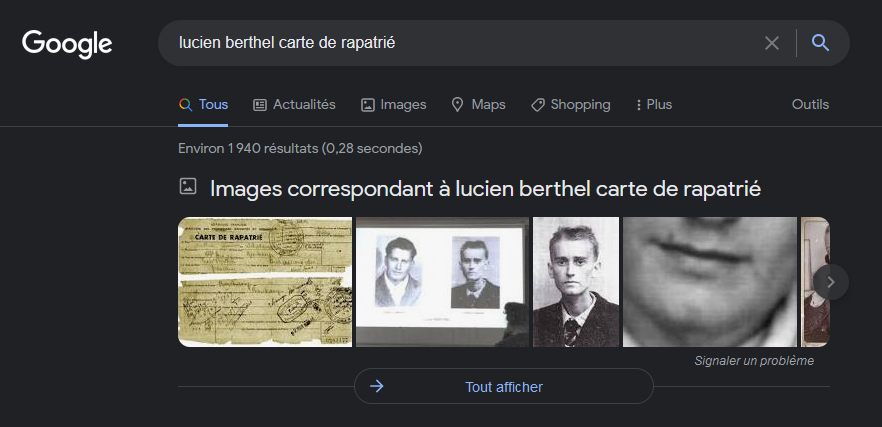
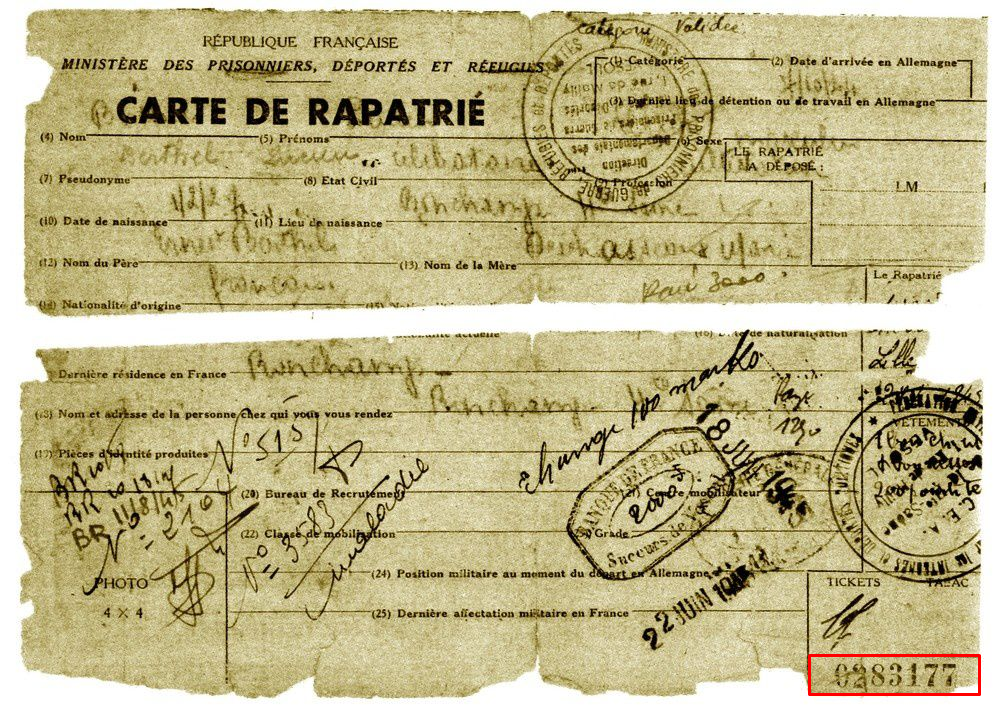

# **Häftling KLB 74515**
## <u>**Catégorie**</u>

Libération

## <u>**Description**</u> :

Lucien Berthel "monte au maquis" en août 1944. Capturé le 18 septembre lors des combats autour de Lure (70), il est emprisonné le lendemain à Belfort (90).

Il est déporté au camp de Buchenwald (Allemagne) par convoi le 3 octobre 1944. Il est ensuite transféré dans les camps de concentrations allemands de Dora, Ellrich puis Bergen-Belsen où il est libéré le 15 avril 1945.

***Question : Quel est le numéro de la carte de rapatrié de Lucien BERTHEL ? (numéro en en bas à droite)***

bleuetdefrance{#######}

## <u>**Auteur**</u> :

Club OSINT & Veille - AEGE

## <u>**Solution**</u> :

Ici aussi, il suffit de rechercher "lucien berthel carte de rapatrié" :

Puis de cliquer sur le premier résultat images

Le numéro de la carte est désormais visible, "0283177"

**Flag : bleuetdefrance{0283177}**