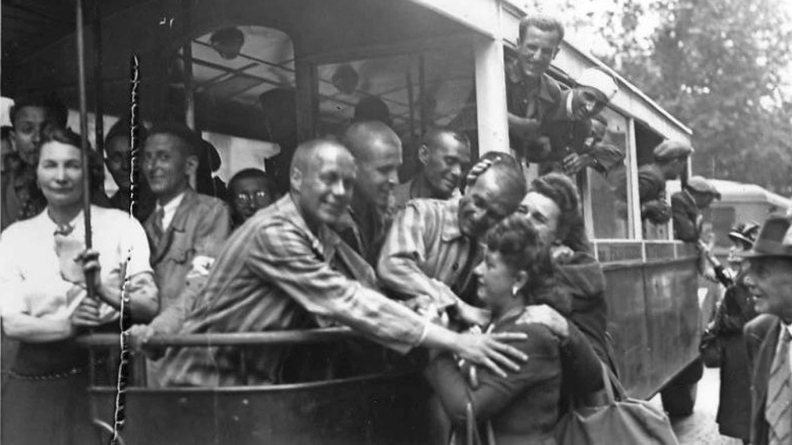
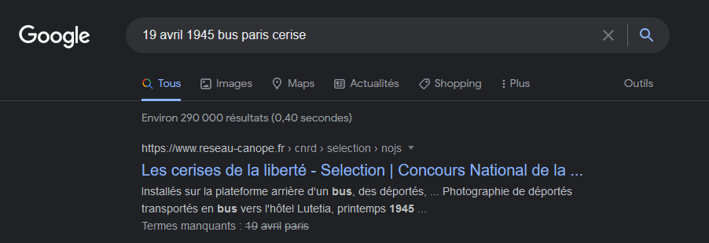
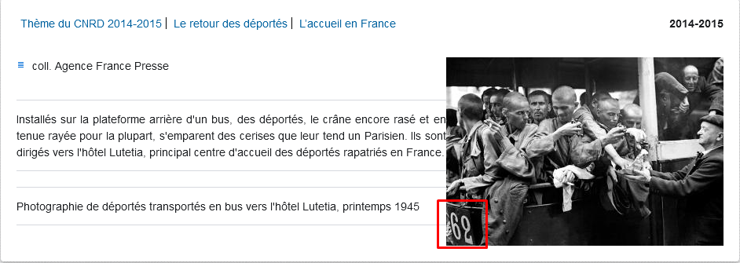

# **Les cerises de la liberté**
## <u>**Catégorie**</u>

Libération

## <u>**Description**</u> :

Dès la libération des camps, les déportés qui sont en état de supporter le voyage reviennent en France.

L'Humanité du 19 avril 1945 raconte :

"Dans toutes les rues, au passage des rapatriés, la population leur réserve un accueil chaleureux. Lorsqu'un camion s'arrête, un attroupement se forme. Les femmes offrent des fleurs, quelques friandises."

Les passagers du bus reçoivent des cerises lors de leur arrivée à Paris.

***Question : Quel est le numéro de ce bus ?***

bleuetdefrance{##}

## <u>**Auteur**</u> :

Club OSINT & Veille - AEGE

## <u>**Solution**</u> :

Pour ce challenge, il suffit de rechercher "19 avril 1945 bus paris cerise" :

Puis de cliquer sur le premier résultat

La réponse apparaît alors, le numéro du bus est le 62.

**Flag : bleuetdefrance{62}**