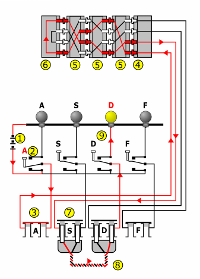
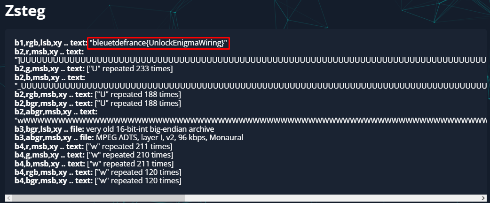

# **Enigma**
## <u>**Catégorie**</u>

Résistance

## <u>**Description**</u> :

***Le réseau de résistance à réussi à intercepter ce plan de chiffrement. Trouvez un moyen de le décrypter pour récupérer son contenu.***

bleuetdefrance{réponse}

## <u>**Auteur**</u> :

Club OSINT & Veille - AEGE

## <u>**Solution**</u> :

Pour ce challenge qui peut mener sur diverses fausses pistes, il faut simplement utiliser aperisolve (https://aperisolve.fr/).

En mettant l'image sur le site, on aperçoit rapidement le flag dans la section zzsteg :

**Flag : bleuetdefrance{UnlockEnigmaWiring}**