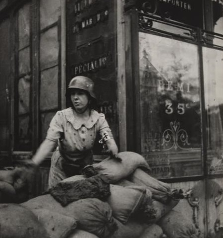
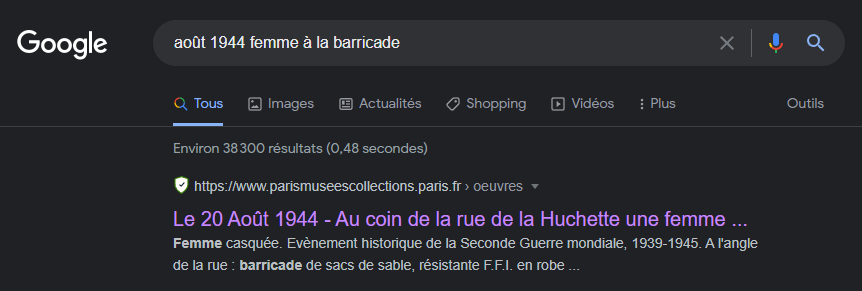
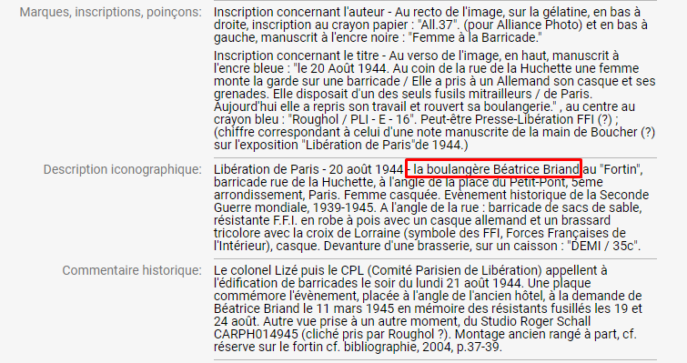
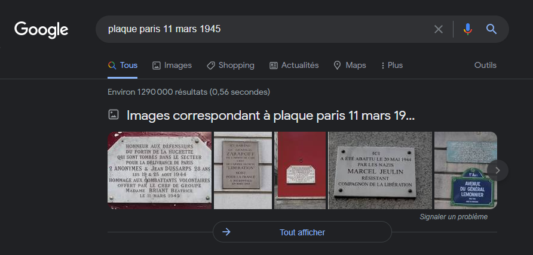
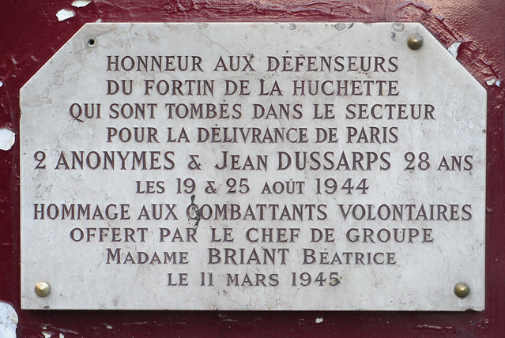

# **Femme à la barricade**
## <u>**Catégorie**</u>

Résistance

## <u>**Description**</u> :

La libération de Paris commence le 19 août, quand les gaullistes et la Résistance lancent un appel à l'insurrection. Dès lors, des barricades se dressent dans les rues et des affrontements éclatent.

On connaît le nom des héros de la Libération de Paris, moins celui des héroïnes. En août 1944, cette chef de groupe de la résistance accompagnée de ses camarades, participe à la libération de Paris.

***Question : Question : Quel est le nom et la profession de cette résistante?***

bleuetdefrance{nom_profession}

## <u>**Auteur**</u> :

Club OSINT & Veille - AEGE

## <u>**Solution**</u> :

Une simple recherche google "août 1944 femme à la barricade" nous mène à un site intéressant

Sur ce site, on peut relever des commentaires historiques/iconographiques :

On apprend donc que la femme s'appelle BRIAND Béatrice et qu'elle est boulangère.

Néanmoins, une erreur figure sur cette page. Sur le nom de famille de la résistante, plus précisément. 

On va donc devoir chercher un peu plus d'informations sur cette personne.

On peut commencer par consulter la plaque posée à la demande de madame BRIAND.

Une rapide recherche sur google nous permet de la retrouver.

En consultant cette plaque, on apprend que son nom est BRIANT et non BRIAND

On a notre flag !

**Flag : bleuetdefrance{BRIANT_boulangère}**