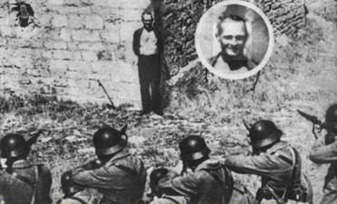
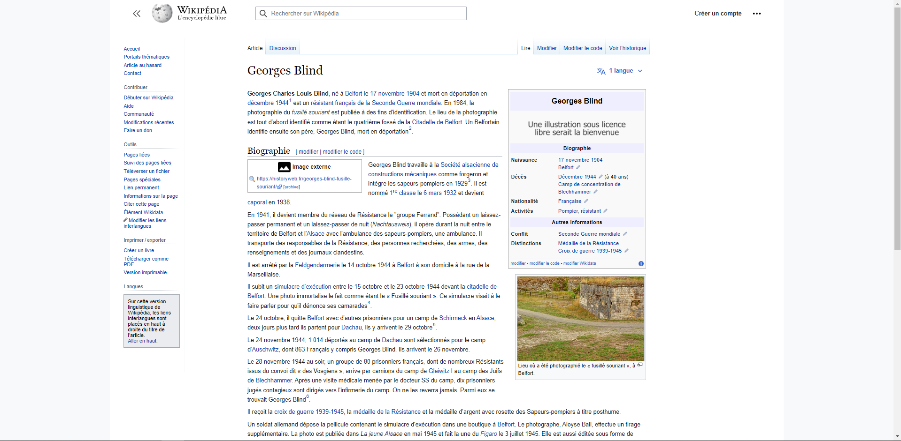
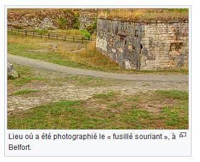
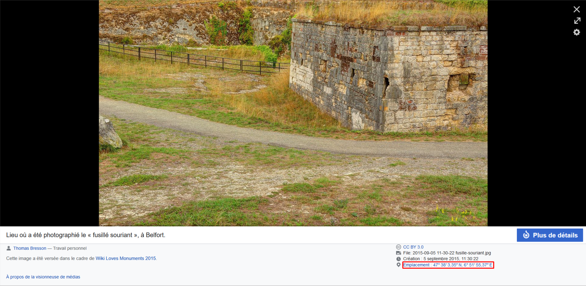

# **Le fusillé souriant**
## <u>**Catégorie**</u>

Résistance

## <u>**Description**</u> :

Sourire plutôt que d'abdiquer : En octobre 1944 à Belfort, mis en joue lors d'un simulacre d'exécution destiné à le faire parler, le caporal infirmier Georges Blind souris face aux fusils des soldats allemands.

Malgré la menace des armes, il ne craquera pas et ne donnera pas les noms de ses camarades de réseau résistant.

***Question : Quelles sont les coordonnées GPS exacte de ce lieu ? (réponse en degrés sexagésimaux)***

bleuetdefrance{XX°XX′X.XX″NX°XX′XX.XX″E}

## <u>**Auteur**</u> :

Club OSINT & Veille - AEGE

## <u>**Solution**</u> :

Pour ce challenge, on va aller consulter la page wikipédia de Georges Blind pour trouver des informations.

On y aperçoit alors le lieu où a été photographié le "fusillé souriant"

En cliquant sur la photo, on peut obtenir des détails sur cette dernière, et notamment le lieu où elle a été prise.

La réponse apparaît alors, les coordonnées GPS sont "47°38′3.35″N6°51′55.37″E"

**Flag : bleuetdefrance{47°38′3.35″N6°51′55.37″E}**