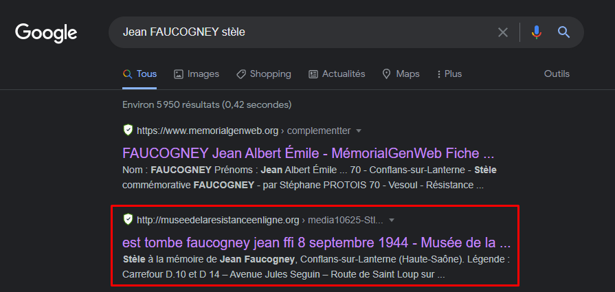
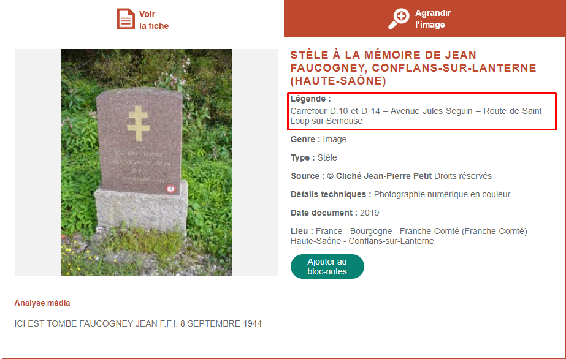
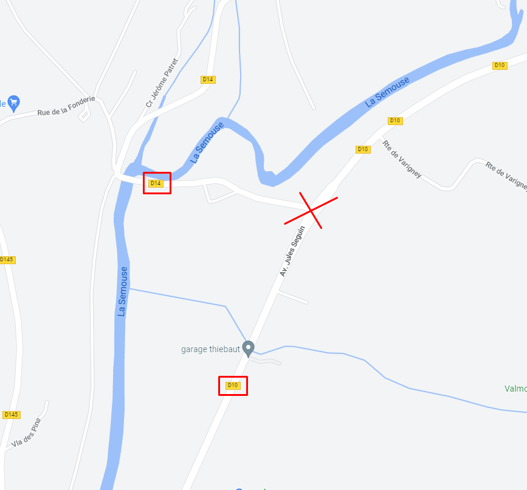
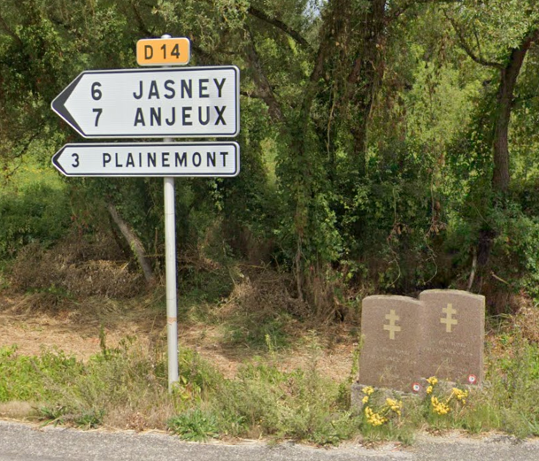

# **Mort pour la France**
## <u>**Catégorie**</u>

Résistance

## <u>**Description**</u> :

Au fur et à mesure de la progression alliée et de la libération de la France, les groupes de maquisards combattent très violemment les troupes allemandes.

Le 8 septembre 1944, Jean FAUCOGNEY, résistant des Forces Françaises de l’Intérieur (FFI), tombe au combat pour la France.

***Question : Quelles sont les communes présentes sur le panneau à côté de la stèle de Jean FAUCOGNEY ? (réponse tout attaché et trié par ordre alphabétique)***

bleuetdefrance{nomsdescommunes}

## <u>**Auteur**</u> :

Club OSINT & Veille - AEGE

## <u>**Solution**</u> :

Pour l'anecdote, Jean FAUCOGNEY est l'arrière grand-père d'un des créateurs de ce CTF. C'est en héritant de ses médailles que l'idée de créer ce CTF a émergé.

Une recherche avec le nom de Jean Faucogney nous mène vers un site dédié à la résistance

On y obtient la localisation de la stèle

Une recherche de l'adresse sur maps nous mène au fameux croisement de la D10 et D14

Il n'y a plus qu'à examiner le panneau :

On a le nom des communes, et donc notre flag.

**Flag : bleuetdefrance{AnjeuxJasneyPlainemont}**