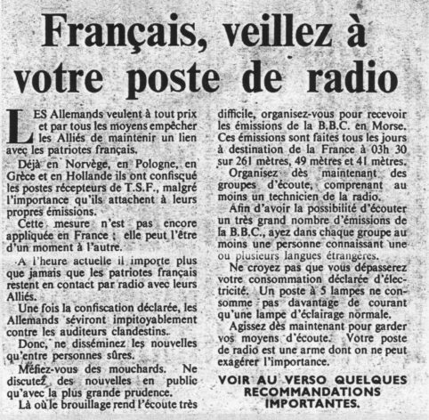
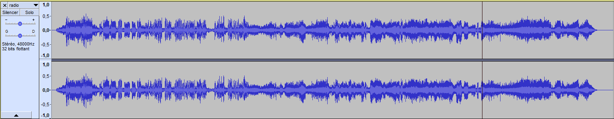
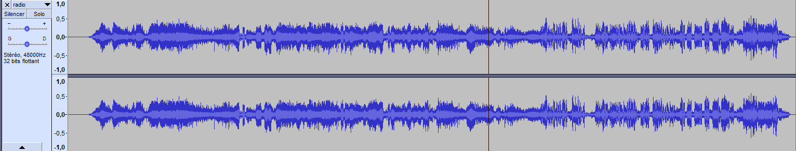

# **Radio Londres**
## <u>**Catégorie**</u>

Résistance

## <u>**Description**</u> :

Le passage d'un message codé à une heure précise doit servir de garantie pour votre prochaine mission. Vous essayez tant bien que mal de déchiffrer le contenu du message que vous entendez de votre poste.

***Question : Quel est le nom du responsable au commandement dans le message radio et à quelle heure sera la prochaine émission radio?***

bleuetdefrance{nom_nombre}

## <u>**Auteur**</u> :

Club OSINT & Veille - AEGE

## <u>**Solution**</u> :

Un fichier audio nous est fourni : https://voca.ro/1jOhC5gI1e0c

En l'écoutant, on se rend compte que certains passages ont été accélérés et d'autres ont, au contraire, été ralentis.

On va donc devoir passer par un logiciel de traitement de son pour modifier la vitesse sur ces différents moments.

Pour l'heure de l'émission, il faudra :
- Changer la vitesse (x4)

On obtient l'heure de la prochaine émission : 17h.

Pour le nom du général, il faudra :
- Changer la vitesse (x2,5)
- Inverser le sens de la piste

On obtient le nom du général : Eisenhower

Le fichier audio modifié est disponible ici : https://voca.ro/12k8S2FpUUqq

Une fois le fichier traité on obtient notre flag : Eisenhower_17

**Flag : bleuetdefrance{Eisenhower_17}**