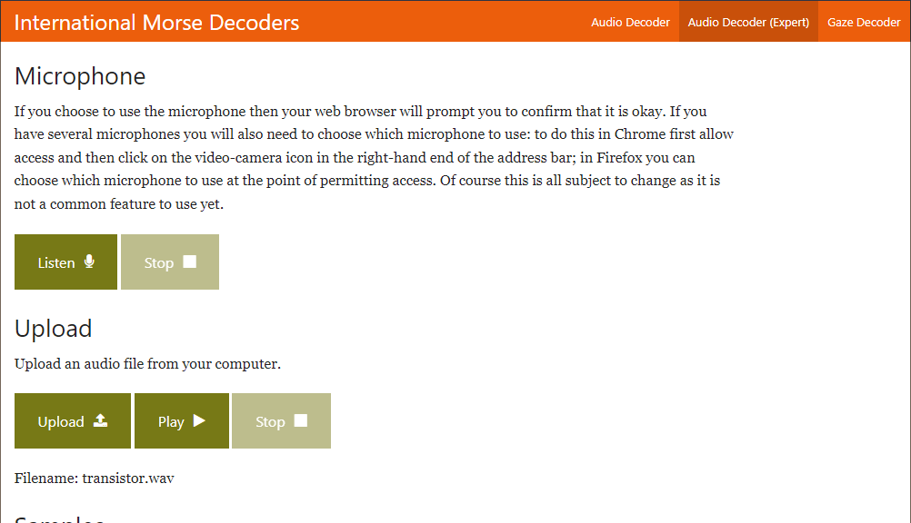
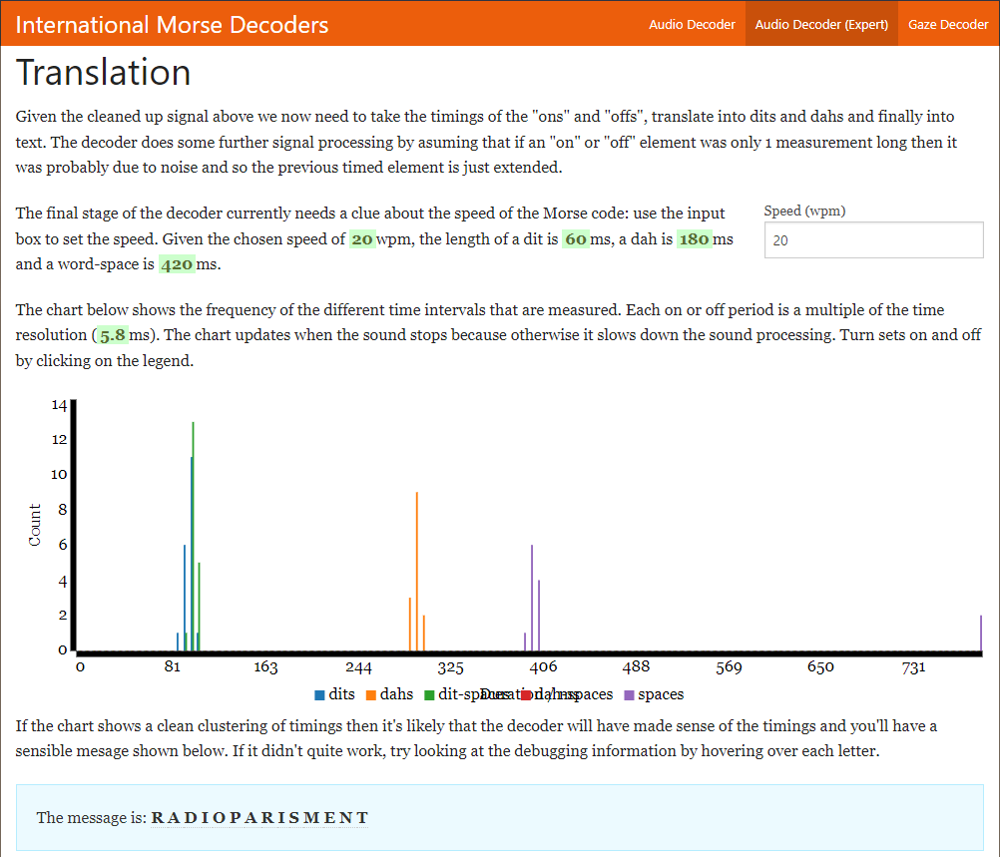

# **Titi-tata**
## <u>**Catégorie**</u>

Résistance

## <u>**Description**</u> :

Un opérateur télégraphiste de votre réseau a intercepté un message d’alerte précieux côté français.

***Question : Quel est le contenu de ce message?***

bleuetdefrance{réponsetoutattaché}

## <u>**Auteur**</u> :

Club OSINT & Veille - AEGE

## <u>**Solution**</u> :

Un fichier audio nous est fourni : https://voca.ro/1kHaWMZx9kEV

En écoutant ce fichier, on comprend qu'il s'agit de morse.

Il suffit donc d'utiliser un decoder de morse audio en ligne (par exemple https://morsecode.world/international/decoder/audio-decoder-expert.html) et y téléverser le fichier :

On lance donc la lecture via le bouton play et on attend la fin du traitement.

Une fois le fichier traité, on obtient notre flag : RADIO PARIS MENT

**Flag : bleuetdefrance{RADIOPARISMENT}**