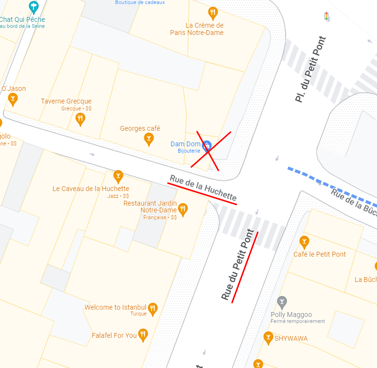
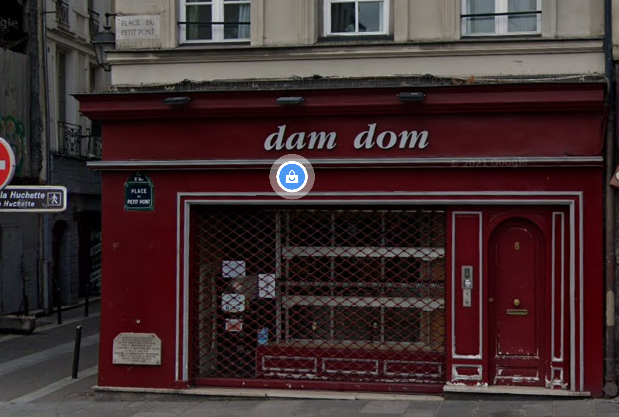
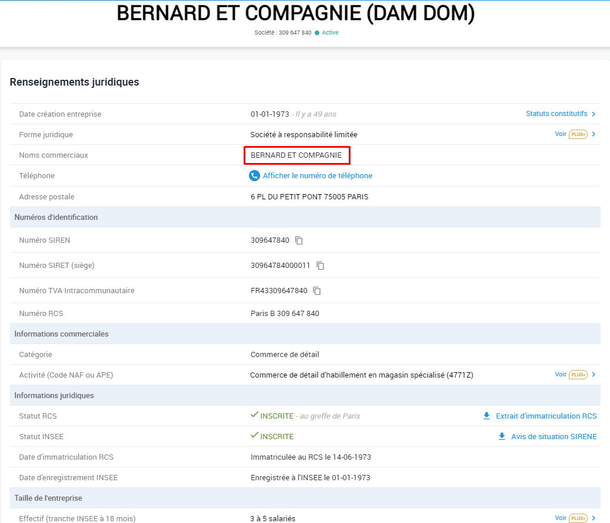
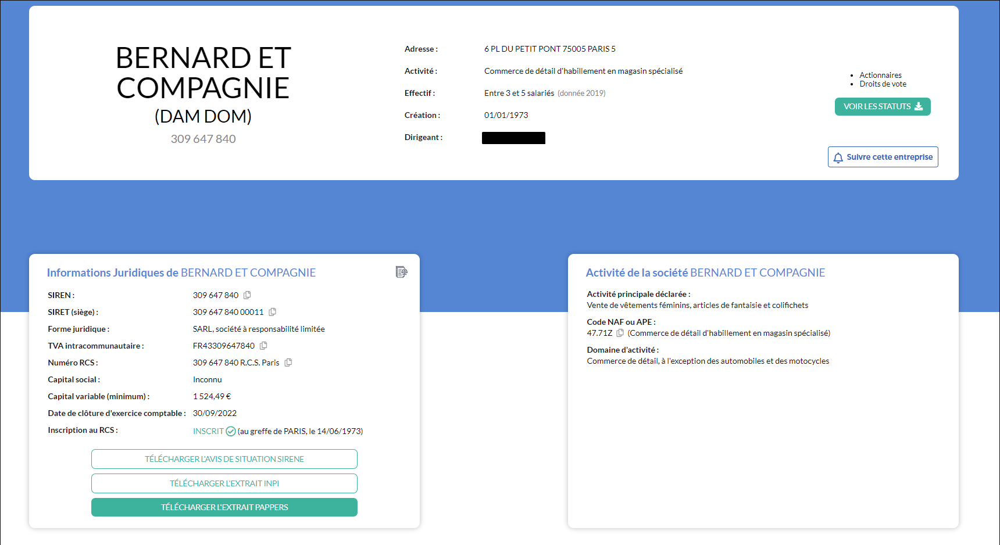
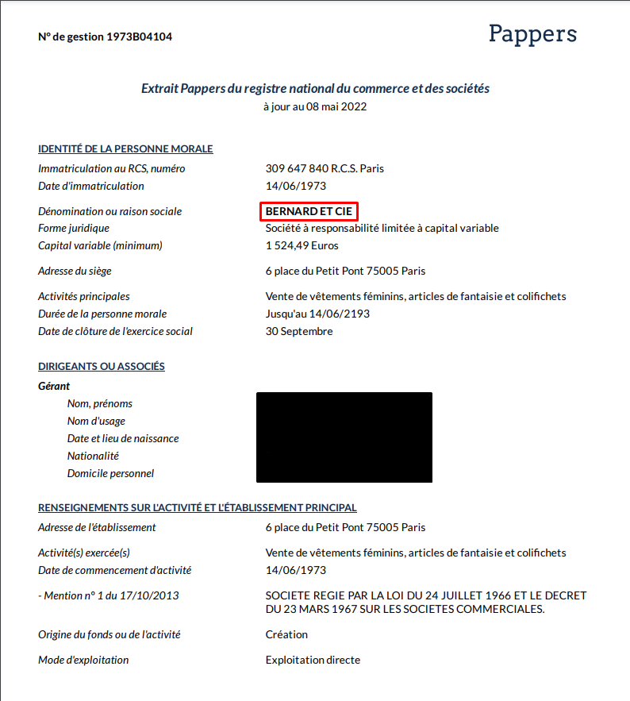

# **Trip advisor**
## <u>**Catégorie**</u>

Résistance

## <u>**Description**</u> :

Dans l’imaginaire collectif, il est compliqué de se dire qu’il y a presque 80 ans se tenaient de violents combats dans Paris.

***Question : Quelle est la dénomination sociale du commerce qui se trouve en lieu et place de la barricade ?***

bleuetdefrance{réponsetoutattaché}

## <u>**Auteur**</u> :

Club OSINT & Veille - AEGE

## <u>**Solution**</u> :

Grâce à nos trouvailles précédentes (celles pour le challenge "Femme à la barricade"), on sait que la rue où se trouvait la barricade est "Rue de la Huchette" et plus précisément à l'angle de la place du "Petit-Pont".

On va donc rechercher sur Google maps le nom du commerce qui y figure actuellement.

On peut également confirmer ça en Street View :

Le nom du commerce est bien "Dam Dom" (on peut même y aperçevoir la plaque commémorative demandée par madame BRIANT).

Une recherche google nous permet de tomber sur sa page societe.com 

Sur cette page, on y apprend que l'entreprise s'appelle en réalité "BERNARD ET COMPAGNIE"

Néanmoins, le flag ne marche pas, il nous manque donc des informations.

On va désormais s'intéresser à Pappers.fr. Ce site a un fonctionnement similaire à celui de societe.com mais fournit beaucoup plus d'informations.

En recherchant le SIRET de BERNARD ET COMPAGNIE sur pappers, on tombe sur la page de l'entreprise :

Néanmoins, toujours pas de nouvelles informations sur la dénomination sociale.

On va donc télécharger l'extrait pappers disponible.

Ce dernier nous donne de nouvelles informations, notamment celle que nous recherchions.  
La dénomination sociale de DAM DOM est donc "BERNARD ET CIE"

**Flag : bleuetdefrance{BERNARDETCIE}**