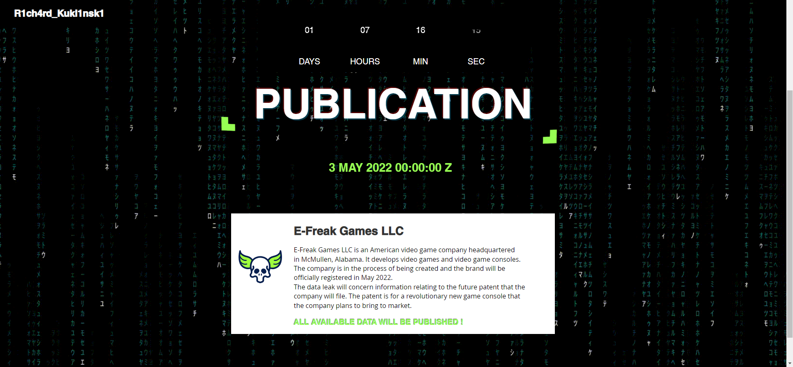

# **Ready ?**
## <u>**Catégorie**</u>

OSINT / 0 Points

## <u>**Description**</u> :

You're an investigative journalist commissioned by a company to carry out a new investigation.

This company is named "E-Freak Games LLC.", and is about to be officially established in a few weeks.
Its CEO contacted you to conduct an investigation on a person threatening to disclose sensitive information on an E-Freak Games LLC patent.
The threats were made on this website: 

https://leakedata.wixsite.com/e-freak-games-leaks

Analyze each element present on this page.
Once you have taken note of this website, submit the following flag : DOCTF{R34DY}

## <u>**Auteur**</u> :

madame_https

## <u>Solution</u> :

Début des challenges OSINT avec une simple investigation du site qui menace de publier des informations sensibles sur E-Freak Games LLC.

On remarque rapidement le nom "R1ch4rd_Kukl1nsk1" en haut à gauche ainsi qu'un timer et une brève description de l'entreprise.

Aucune information intéressante ne figure dans le code source.

Une fois les informations glânées, il ne reste plus qu'à rentrer le flag donné dans l'énoncé.

**Flag : DOCTF{R34DY}**