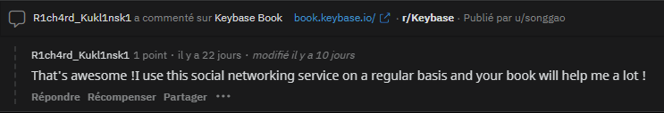

# **Wrote that**
## <u>**Catégorie**</u>

OSINT / 50 Points

## <u>**Description**</u> :

You have read the elements displayed on the website.

It seems that the person behind these threats is present on a discussion website where they share their passions for various subjects.
Find their profile and find the tool/site of which they claim to be a regular user.

On which other website/tool/application are they a regular user ? 

Flag format : DOCTF{Name}

## <u>**Auteur**</u> :

madame_https

## <u>Solution</u> :

D'après la description du challenge, "l'auteur de ces menaces semble être présent sur un site de discussion où les gens partagent leurs passions pour différents sujets".

Avant d'utiliser Sherlock ou un autre outil d'énumération de compte, on pense à reddit.

En cherchant "R1ch4rd_Kukl1nsk1", on tombe bien sur un profil

Désormais, il faut trouver le site, l'application ou l'outil que R1ch4rd_Kukl1nsk1 utilise souvent.

En parcourant un peu les commentaires qu'a pu laisser notre cible, il semblerait qu'elle nous donne la réponse :

Le post concernant l'application "Keybase", on a notre flag !

**Flag : DOCTF{Keybase}**