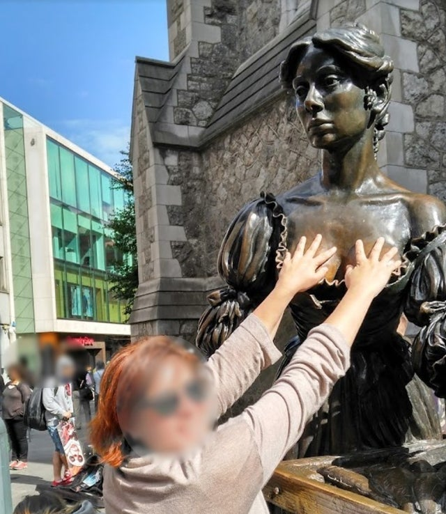
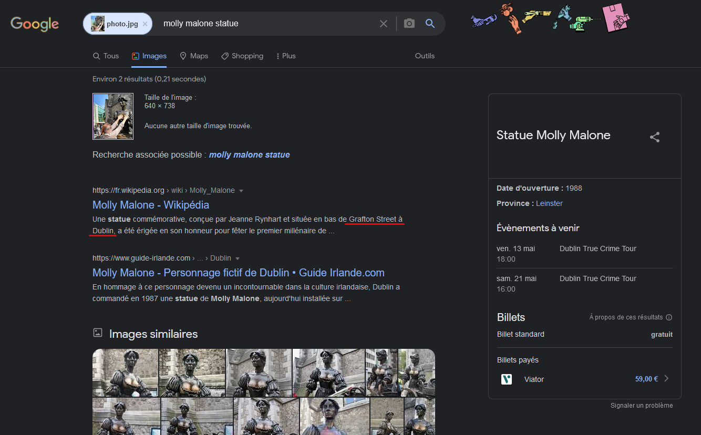

# **Rainbowy [GEOINT]**
## <u>**Catégorie**</u>

OSINT / 100 Points

## <u>**Description**</u> :

Before switching to this other platform, we would like to collect more information on the person responsible of the threats.

Analyze the site you were on. It looks like the owner of the profile posted some photos a few days ago. Find them first. Geolocate the photo on which appears a red-haired woman. 

In which city was this photo taken? 
Flag format : DOCTF{City}

## <u>**Auteur**</u> :

madame_https

## <u>Solution</u> :

D'après la description challenge, notre utilisateur aurait poster des photos il y a quelques jours... Malheureusement, et d'après le site, "u/R1ch4rd_Kukl1nsk1 n'a encore rien publié".

On va donc utiliser la wayback machine pour voir s'il y a possibilité de retrouver ce post supprimé.

Bingo ! On tombe sur une archive faite il y a quelques jours (https://web.archive.org/web/20220428210431/https://www.reddit.com/user/R1ch4rd_Kukl1nsk1/)

On retrouve un post publié dans le "r/travel" où apparaît... une femme rousse !

En faisant une recherche inversée de la photo, le nom d'une statue ressort.

Il s'agit de la Molly Malone à... Dublin !

On a donc notre flag.

**Flag : DOCTF{Dublin}**