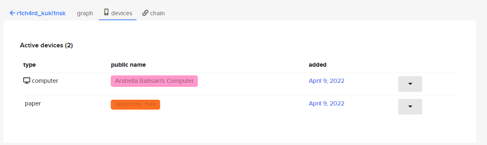
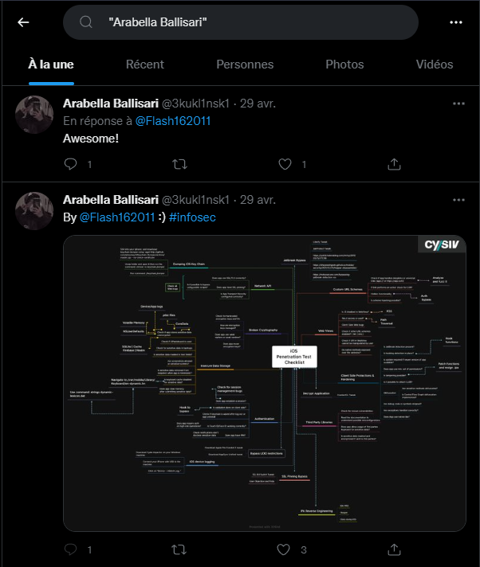
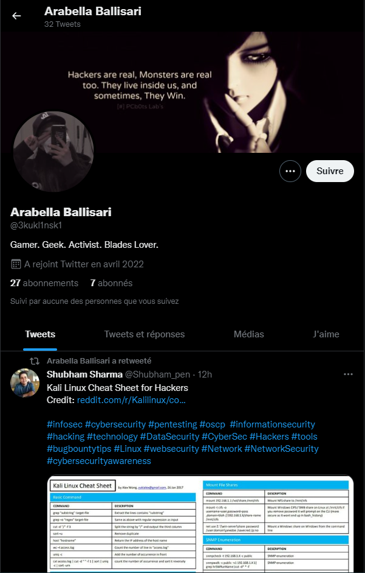
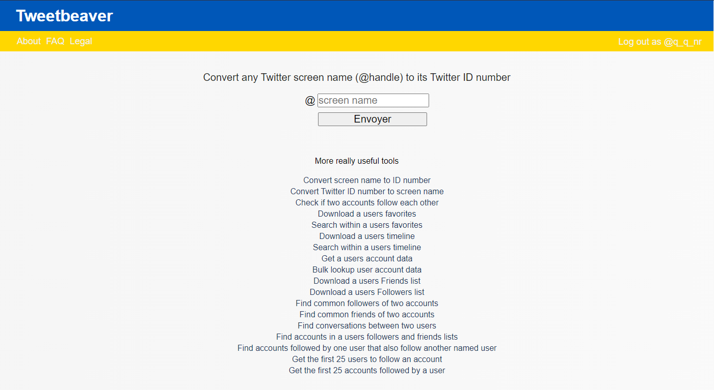

# **Mendax ?**
## <u>**Catégorie**</u>

OSINT / 50 Points

## <u>**Description**</u> :

Now let's move on to the new platform you found earlier.
Find the profile of the person and the identity they would have used on this platform (last name and first name).

Caution ! It could be a fake name to mislead us, so be on your guard.

From this identity, find on which other website it was used. Once found, provide us with the numerical Profile ID of the person causing the threats against E-Freak Games LLC.

Flag format : DOCTF{ID}

## <u>**Auteur**</u> :

madame_https

## <u>Solution</u> :

On continue l'enquête en se rendant sur keybase.io

Ici, on va rechercher l'utilisateur "R1ch4rd_Kukl1nsk1" et accéder à son profil.

Après avoir regardé les followers et followings ainsi que les teams, on va s'intéresser aux appareils utilisés par le hacker.

Ici, deux appareils sont affichés :  
- Le premier, "Arabella Ballisari's Computer"  
- Le second, "approve ten"  

Le premier contenant un nom, on va s'intéresser à ce dernier.

Maintenant qu'on a un nom (si tant est que ce dernier ne soit pas un faux), on doit trouver le site sur lequel il est utilisé.

Pour cela et avant de commencer des investigations plus complexes, on va s'intéresser à l'un des sites les plus utilisé du monde : Twitter  

On va donc chercher "Arabella Ballisari" dans la barre de recherche.

En regardant ce profil de plus près :

- La personne se décrit comme "Gamer. Geek. Activist. Blades Lover."  
- Sa bannière semble indiquer qu'elle fait partie du milieu du hacking  
- Ses RTs corroborent sa version (majoritairement liés à la cybersécurité et au monde du hacking en général)

On a donc trouvé la bonne personne, il n'y a plus qu'à convertir son @ en ID.

Ici, on va utiliser TweetBeaver qui va faire ça pour nous 

Il suffit de rentrer le "@3kukl1nsk1" afin d'obtenir l'ID 

ID : 1512816977072599044

**Flag : DOCTF{1512816977072599044}**