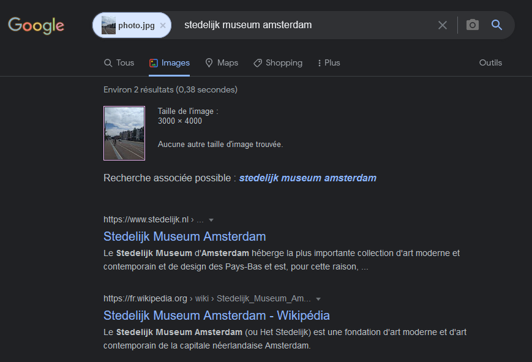
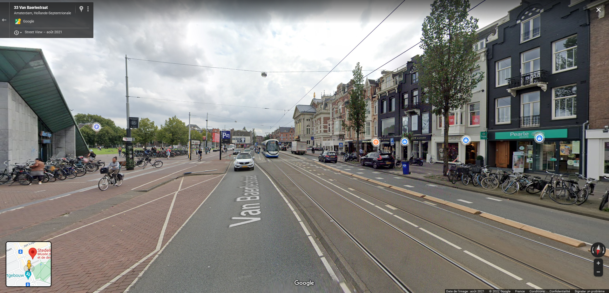
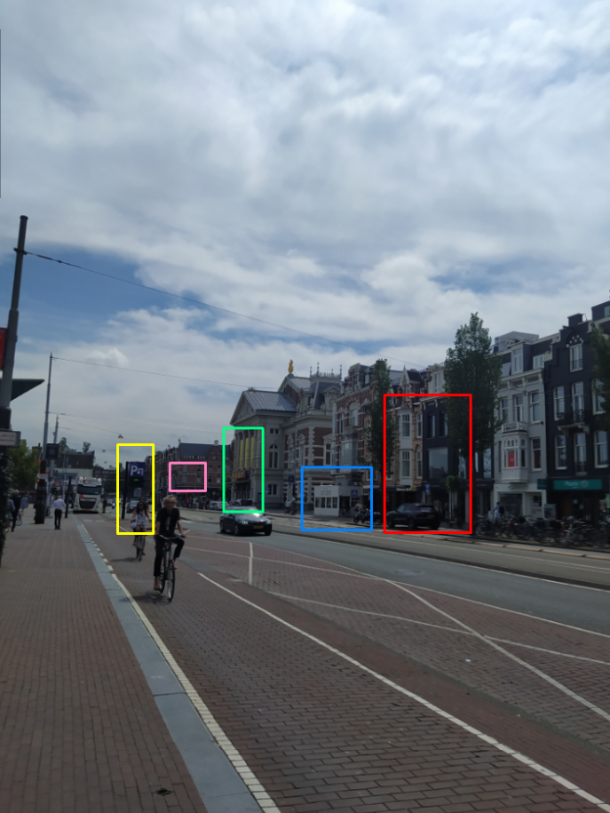
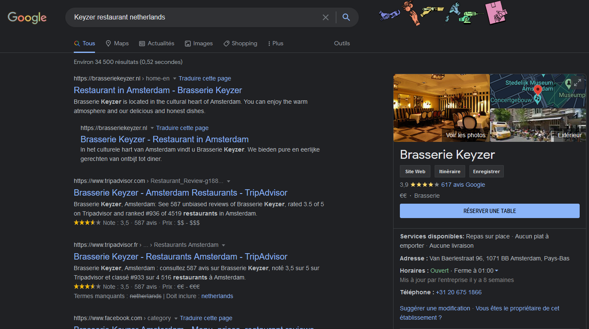
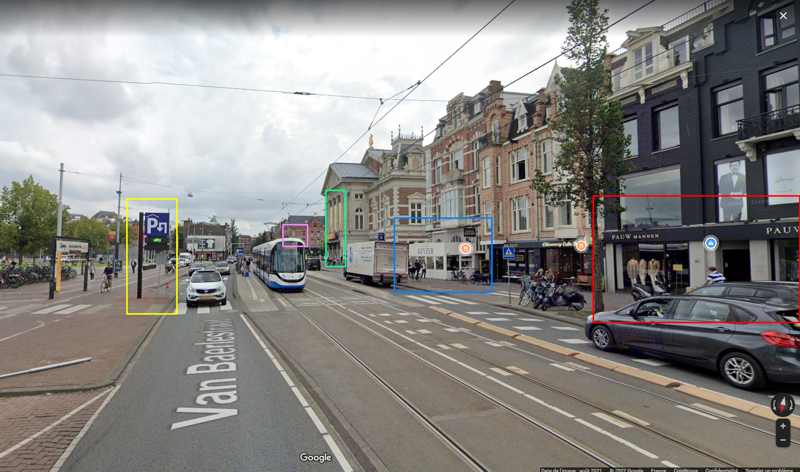

# **Hermit [GEOINT]**
## <u>**Catégorie**</u>

OSINT / 100 Points

## <u>**Description**</u> :

While you were investigating, we were able to collect information from the person's very first nickname.

It seems that this hacker comes out of his den from time to time to travel... Here is a photo attached.

In which city was this photo taken?

Flag format : DOCTF{City}

## <u>**Auteur**</u> :

madame_https

## <u>Solution</u> :

Ici, une photo est attachée

À partir de là, le challenge peut-être effectué de deux façons : 
La première, via la recherche inversée qui nous retourne le "Stedelijk Museum" à Amsterdam :

En nous intéressant à l'extérieur du musée, on tombe sur le même environnement.

On a donc notre flag.

------------------------------------------------------------------------------------------------

La seconde consiste à s'intéresser plus précisément à l'image :  
Aucune info EXIF n'est présente mais on peut voir sur cette dernière quelques éléments intéressants :  

- En rouge, un grand bâtiment noir (potentiellement lié à un restaurant?) est présent.  
- En bleu, une brasserie du nom de Keyzer 
- En vert, une devanture avec de grandes affiches (musée? théâtre? opéra?)
- En rose, une banque est indiquée, "Rabobank"
- En jaune, un panneau qui indique un parking, ce qui pourra nous aider à localiser avec exactitude cet endroit.

En nous intéressant plus spécifiquement à la banque, Rabobank, on apprend que c'est une banque originaire des pays-bas et massivement présente dans ce pays.
On va donc chercher "Keyzer restaurant Netherlands" :

et s'intéresser à l'extérieur de ce magasin.

Tous les éléments concordent !  On a donc notre flag.

**Flag : DOCTF{Amsterdam}**