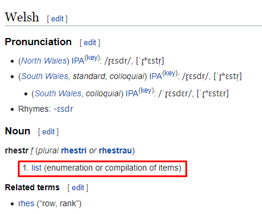
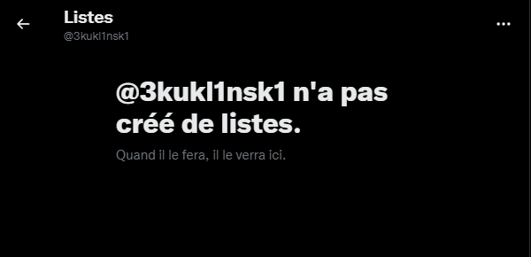
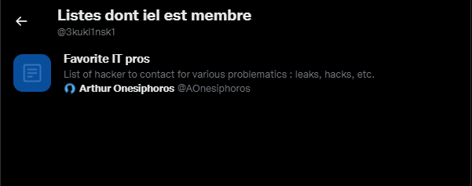
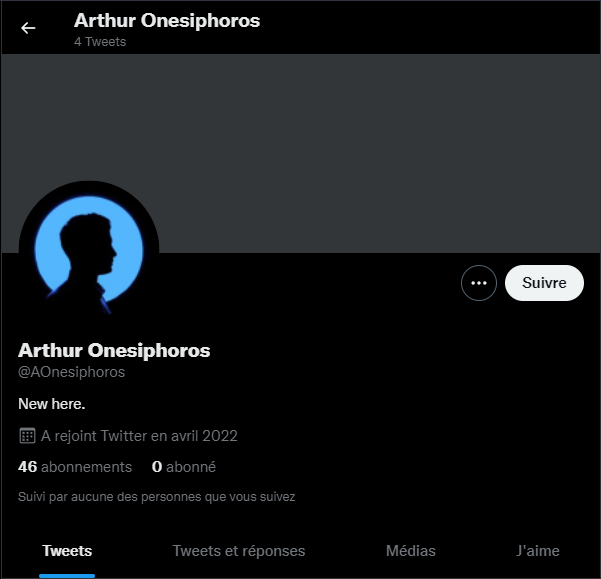

# **Rhestri**
## <u>**Catégorie**</u>

OSINT / 50 Points

## <u>**Description**</u> :

We are approaching the goal. One of our sources has just provided us with valuable information. 

It seems that it is now possible to identify the person who commissioned the hacker behind the future leak.

Analyze the profile attached to the ID you collected earlier.
The profile of the mandator and the hacker are linked in a particular way.

Look for this bond, once found, provide us with the identity of the mandator.

Flag format : DOCTF{Name_LastName}

## <u>**Auteur**</u> :

madame_https

## <u>Solution</u> :

Ici, le nom du chall saute aux yeux "Rhestri".

En cherchant un peu, on apprend que c'est le pluriel de "rhestr" qui signifie "list".

On comprend donc qu'il va falloir s'intéresser aux listes d'Arabella.

Malheureusement, il semblerait qu'elle n'ait créée aucune liste.

On va désormais vérifier les listes dont iel est membre :

Gagné ! Arabella fait bien partie d'une liste.

Cette liste a été créée par un certain "Arthur Onesiphoros"

On a donc notre flag ! 

**Flag : DOCTF{Arthur_Onesiphoros}**