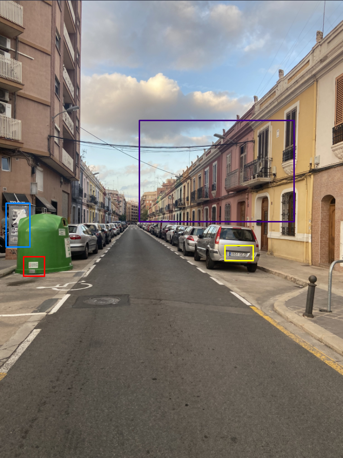

# **r/LetsMeet [GEOINT]**
## <u>**Catégorie**</u>

OSINT / 100 Points

## <u>**Description**</u> :

While you were investigating, we were able to collect additional information about these two people.

It seems that these two met in real life to conspire against the company E-Freak Games LLC a few weeks ago.

A photo of this IRL encounter has leaked. You will find it attached.

In which city was this photo taken ? (The expected city name is in English).

Flag Format: DOCTF{City}

## <u>**Auteur**</u> :

madame_https

## <u>Solution</u> :

Ici, et comme pour le challenge Hermit, il faut retrouver une ville à partir d'une photo

On remarque rapidement des éléments intéressants :

- En jaune, la plaque d'immatriculation, visiblement européenne.
- En rouge, la poubelle de tri verte qui a une plaque visible, qui pourrait contenir des éléments intéressants.
- En bleu, l'affiche collée qui, elle aussi, peut contenir des éléments intéressants.
- En violet, les bâtiments très colorés, possiblement endémiques à des pays chauds.

En regardant avec plus de précision la plaque, un "E" y est inscrit. Cela indique que la voiture a été immatriculée en Espagne (https://www.eplaque.fr/plaque-immatriculation/pays/europeen).

La plaque sur la poubelle indique "Generalitat Valenciana", qui est l'institution de la Communauté Valencienne.

En bleu, et bien que l'affiche soit partiellement décolée, on arrive à récupérer les informations suivantes : "Expo Dinos Val Bio 11 Sept"

En couplant cela à l'information que nous sommes dans la Communauté de Valenciana, nous partons du principe que nous sommes potentiellement à Valence.

En recherchant "Expo Dino Valencia Bio 11 Sept" sur google 

On apprend qu'il y a bel et bien eu une expositions sur les dinosaures à Valence pour ces dates.

Il ne nous reste plus qu'à rentrer le nom de la ville en anglais pour obtenir le flag; à savoir "Valencia"

**Flag : DOCTF{Valencia}**
