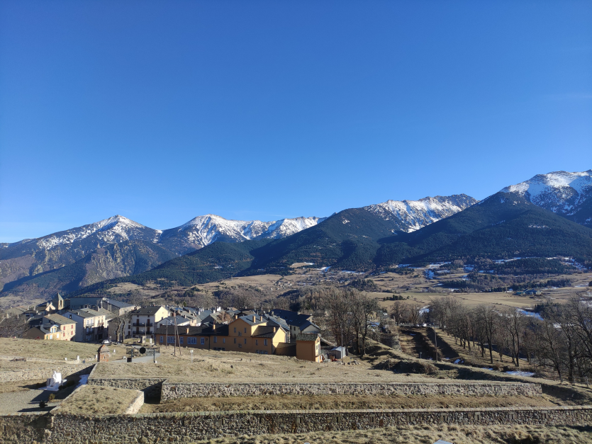
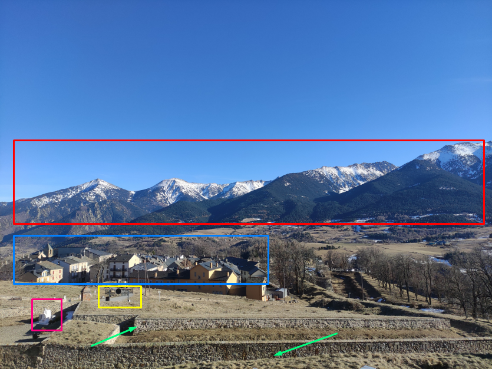
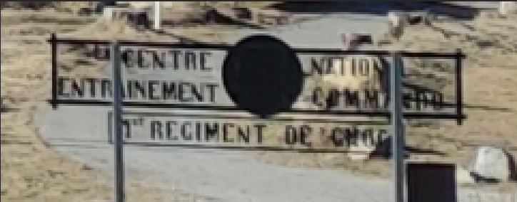
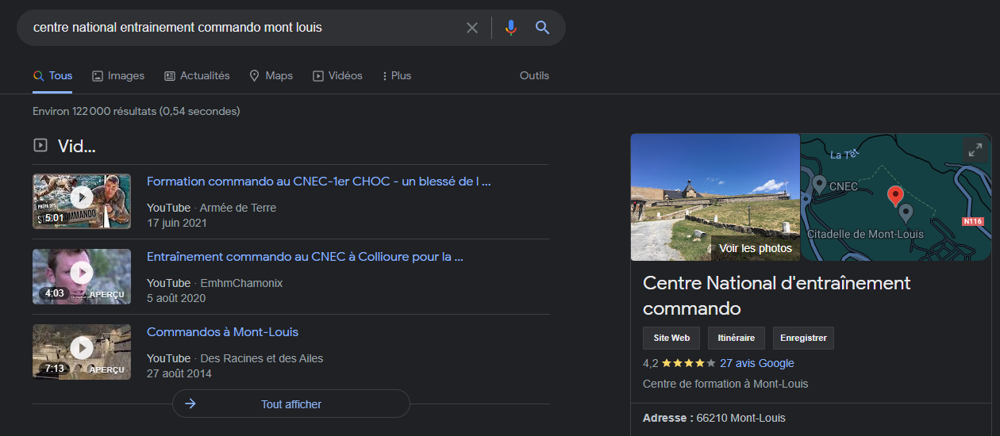
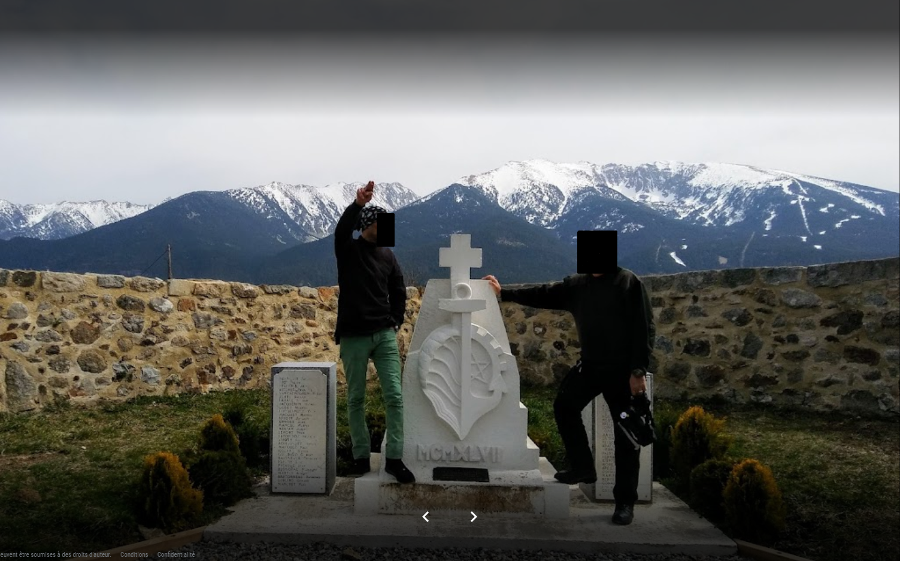
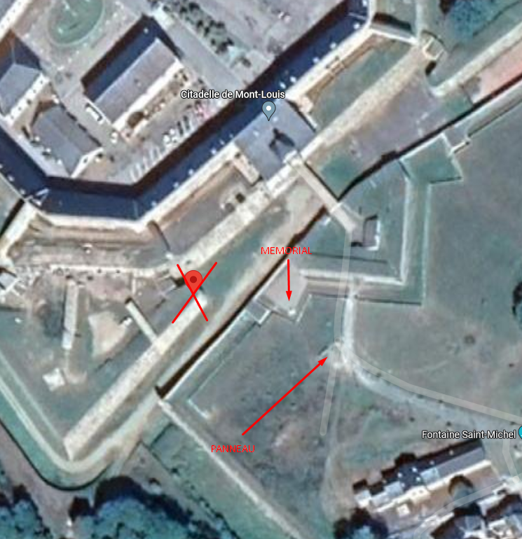

# **Challenge AEGE 6**
## <u>**Catégorie**</u>

OSINT / GEOINT

## <u>**Description**</u> :

Déterminez le lieu exact de la prise de cette photographie.
(Des coordonnées GPS sont attendues)

## <u>**Auteur**</u> :

Club OSINT & Veille - AEGE

## <u>**Hints**</u> :

Estoy cerca de una frontera.

(Si j'avais vu le hint, j'aurais pu m'en servir mais... je l'ai vu après haha, ce pourquoi il ne figurera pas dans ce WU)

## <u>Solution</u> :

On va commencer par regarder la photo (jusque là, ça va)

On remarque très rapidement plusieurs éléments intéressants :

- En rouge, on observe des montagnes (évidemment..)
- En bleu, des maisons typiques du sud de la France
- En rose, un mémorial ou une tombe
- En jaune, un panneau
- En vert, la configuration atypique du lieu

À partir de ces éléments, on imagine alors qu'on est sur un lieu militaire, ou tout du moins un mémorial d'une guerre ou d'un conflit militaire passé.

Nous allons désormais nous focaliser sur le panneau en premier, afin de voir les choses qui y sont écrites.

En zoomant et en cleanant l'image, puis en applicant un effet miroir, on se retrouve avec ce résultat :

On peut voir qu'il y a écrit "Centre National Entrainement Commando 1er Régiment de Choc". 

On va désormais chercher où se trouve ce centre. En cherchant ce qu'il y a indiqué sur le panneau sur Google, le moteur de recherche nous permet de compléter la recherche avec la ville de... Mont-Louis !

En jouant avec les différentes photos sur Google Maps, notamment :  

 

 

On remarque que le panneau est en face du fort et proche d'un chemin avec un grand virage (qui mène justement à l'intérieur de la base).

On trouve également une photo prise devant la statue, qui nous confirme bien que c'est un mémorial : 

Une photo prise depuis un drone est également disponible et nous permet de confirmer notre hypothèse.

La croix violette correspond donc à l'endroit où la photo a été prise.

On vient confirmer ça avec la vue satellite de Google Maps 

Il ne reste plus qu'à noter les coordonnées GPS, et on obtient le flag ! 

**Flag : 42.509306, 2.119389**