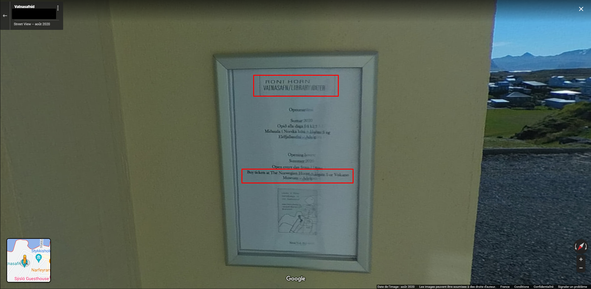

# **Challenge Linkedin - Semaine 18**
## <u>**Catégorie**</u>

OSINT / GEOINT

## <u>**Description**</u> :

Question 1 : combien de touches possède le digicode à l'entrée du batiment où se situe cette webcam ?  
Question 2 : combien coute l'entrée de ce batiment pour un adulte s'il prend son billet sur place ?  
Question 3 : quelle est l'adresse IP de cette webcam ?  
Question 4 : quel est le modèle exact de la webcam ?  
Question 5 : si j'etais un hacker, quelle combinaison de login/passsord d'administration j'essayerai sur la webcam en premier ?  

## <u>**Auteur**</u> :

Julien Métayer

## <u>Solution</u> :

Pour pouvoir répondre aux questions, il faut déjà retrouver le lieu où se trouve la webcam

Sur la photo jointe au challenge, on remarque rapidement des éléments intéressants :

- En rouge, on remarque un drapeau, visiblement Islandais.
- En rose, on remarque la forme particulière des bâtiments. Cette forme est endémique aux pays du nord.
- En jaune, on remarque un petit port.
- En violet, les bâtiments très colorés, possiblement endémiques à des pays chauds.
- En bleu, on remarque des terres qui semblent assez proches. Le port donnant donc sur d'autres parties du pays.

On peut désormais chercher une webcam en Islande, proche d'un petit port.

En utilisant le site worldcam.eu avec les paramètres "Islande - Webcams" (https://fr.worldcam.eu/webcams/europe/iceland/list/25), on tombe sur un résultat qui semble correspondre : 

On arrive sur la page de la webcam : 

Cette dernière semble correspondre mais, étant pivotante, nous ne pouvons pas tout de suite confirmer ce propos.

Nous allons donc vérifier via Maps si nous sommes sur la bonne piste à partir du nom de la ville.

À partir de la photo d'un utilisateur, on peut venir confirmer notre hypothèse.

Désormais, retour sur la webcam pour répondre aux 3 dernières questions. 

Sur la bonne de worldcam.eu, on peut trouver la source de la webcam :

La source nous redirige elle-même vers une autre page :

Qui semble être la source originale : 

Cette page nous permet encore une fois de confirmer notre hypothèse et permet de répondre à plusieurs questions.

En premier, on peut répondre à la question "quel est le modèle exact de la webcam ?", le nom étant indiqué en haut de la page : AXIS P5415-E

Puis, on peut répondre à la quatrième question "quelle est l'adresse IP de cette webcam ?". Pour cela, il nous suffit d'interroger les DNS de "http://cam.stykk.is/".

On peut soit passer par un nslookup, soit par un ping 

On a désormais la réponse à la quatrième question ! 157.157.138.235

On passe désormais à la cinquième question "Si j'etais un hacker, quelle combinaison de login/passsord d'administration j'essayerai sur la webcam en premier ?". Pour celle la, on est tout de suite tenté de répondre toutes les combinaisons usines possibles : admin/pass, root/root, root/toor etc etc etc... Et on aurait raison !

En fouillant un peu à partir du nom de la webcam suivi de "default password, on tombe sur plusieurs résultats : 

En se penchant sur le deuxième résultat (https://www.axis.com/fr/support/faq//FAQ115870), on obtient la réponse à notre question ! 

D'après ce site, il faudrait essayer root/pass ! 

Mais d'après une autre ressource, la documentation officielle de la caméra (https://www.axis.com/dam/public/91/e4/1c/axis-p5415-e--user-manual-en-US-106875.pdf), les nouveaux produits ne possèdent plus de mots de passe définis en usine, ce qui force l'administrateur à configurer un mot de passe lui-même!

On peut désormais repasser aux questions 1 et 2.

Pour la question, "Combien de touches possède le digicode à l'entrée du batiment où se situe cette webcam?", il va tout d'abord falloir trouver le bâtiment.

Direction maps, et plus précisément la photo de l'utilisateur que nous avons utilisé pour vérifier notre hypothèse tout a l'heure.

La vue étant quasiment la même que celle de la photo originale, on suppose que la webcam se trouve sur le bâtiment qui est sur la vallée.

Sur maps, une photo a été prise par un utilisateur devant ce bâtiment. On peut donc vérifier la présence de la webcam.

Il ne reste plus qu'à trouver le nombre de touches que possède le digicode de la porte d'entrée... Et ça tombe bien ! L'utilisateur qui a prit la photo devant le bâtiment l'a également visité en le prenant en photo !

En parcourant ses captures, on tombe donc rapidement sur la porte d'entrée, et donc, sur le digicode.

Le digicode a 13 touches ! 

Il ne reste plus qu'à répondre à la deuxième question, "combien coute l'entrée de ce batiment pour un adulte s'il prend son billet sur place ?". Encore une fois, ça tombe bien ! L'utilisateur qui a prit en photo le digicode a également, et sur la même photo, capturé une affiche qui parle de l'achat des billets.

On peut y lire "Buy tickets at The Norwegian House [...] or Volcano Museum [...]". On apprend également le nom du bâtiment, à savoir Vatnasafn/Library of Water (le texte est un peu illisible mais une recherche Google nous le confirme).

Il suffit donc désormais de faire une recherche sur cette fameuse Norwegian House :

Et de récupérer l'information !

Le prix est donc de 650 ISK (Couronne Islandaise), soit 4,72€ !

**Flag 1: {13}**  
**Flag 2: {650 ISK}**  
**Flag 3: {157.157.138.235}**  
**Flag 4: {AXIS P5415-E}**  
**Flag 5: {root/pass}**  
